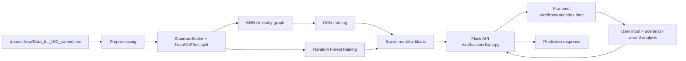

# AI-Based Reliability Prediction Framework for Smart Grid Cloud Applications

## 1. Project Title

AI-Based Reliability Prediction Framework for Smart Grid Cloud Applications using Graph Neural Networks

## 2. Project Overview

This project builds a smart-grid reliability prediction system that uses machine learning to classify whether a grid operating state is stable or unstable. In simple terms, the system takes input values such as power flow, generator control values, and time constants, then predicts whether the grid state is likely to remain stable or fail under stress.

The main idea is to combine two models:

- a Graph Neural Network (GCN) that uses a similarity-based graph over samples
- a Random Forest classifier that acts as a baseline model

The project reads smart-grid operating data, preprocesses it, builds a graph, trains both models, and exposes a web interface where users can enter grid values and get a predicted outcome, reliability score, risk level, and maintenance guidance.

The complete workflow is:

1. Load the smart-grid dataset.
2. Remove duplicates and missing values.
3. Select the 12 operating features.
4. Standardize the feature values.
5. Split the data into training, validation, and test sets.
6. Build a KNN similarity graph where each sample becomes a node and similar samples are connected.
7. Train a GCN on the graph and a Random Forest on the same feature vectors.
8. Save the trained models and evaluation results.
9. Expose a Flask API for predictions.
10. Use a frontend page for input, visualization, scenario simulation, and what-if evaluation.

## 3. Problem Statement

Modern smart grids use many sensors, controllers, and communicating devices. Small shifts in operating conditions can trigger instability, equipment stress, or failure. Traditional rule-based methods and ordinary tabular machine learning methods often fail to capture the relationships among grid states.

This project addresses that problem by using graph-based learning to model the relationships between similar operating samples and using a probabilistic prediction output to estimate reliability and risk.

## 4. Objectives

- Build an AI-based reliability prediction system for smart-grid operating states.
- Use a graph-based model to capture local relationships among samples.
- Train and compare a GCN with a Random Forest baseline.
- Predict the class label as either Stable or Unstable.
- Estimate a reliability score and classify the risk level.
- Provide maintenance recommendations based on predicted reliability.
- Expose the system through a web interface and Flask API.
- Support what-if analysis and simulated fault-scenario testing.

## 5. Key Features

The following features are implemented in the repository code and application logic:

- GNN prediction
- Random Forest baseline
- Reliability score
- Risk classification
- Maintenance recommendation
- Model agreement
- Feature importance
- What-If reliability analysis
- Fault Scenario Simulator
- Real-Time Grid Simulation
- AWS cloud integration (frontend references an external Lambda endpoint; no AWS deployment/source files are included in this repository)

The following feature is mentioned in project discussion but is not implemented in the repository code itself:

- SNS email alerts: Proposed / Not currently implemented

## 6. Dataset

### Dataset used

The project uses the dataset file:

- dataset/raw/Data_for_UCI_named.csv

The repository documentation identifies it as the Smart Grid Stability Prediction dataset from the UCI Machine Learning Repository.

### Dataset statistics

From the actual CSV file:

- Number of records: 10,000
- Number of columns: 14
- Features used by the model: 12
- Target column used: stabf

### Input features used in the model

The model uses the following 12 input features:

- tau1
- tau2
- tau3
- tau4
- p1
- p2
- p3
- p4
- g1
- g2
- g3
- g4

These features are selected in the preprocessing script and saved in dataset/processed/features.txt.

### Target variable

The target is the column stabf, which is mapped as:

- stable -> 0
- unstable -> 1

This is implemented in src/ai_model/preprocess.py.

## 7. Data Preprocessing

The preprocessing pipeline is implemented in src/ai_model/preprocess.py.

### Actual preprocessing steps

1. Load the CSV file from dataset/raw/Data_for_UCI_named.csv.
2. Remove duplicate rows.
3. Check missing values and remove rows if present.
4. Select the 12 feature columns.
5. Map the class label stabf to numeric values: stable=0, unstable=1.
6. Scale features using StandardScaler.
7. Split data into train, validation, and test sets.
8. Build a KNN-based similarity graph.
9. Save the processed graph and scaler object to dataset/processed.

### Scaling

The code uses:

- StandardScaler from scikit-learn

The features are scaled before training and before model inference in the backend.

### Train/validation/test split

The code uses train_test_split twice:

- First split: 70% training, 30% temporary data
- Second split: from the remaining 30%, 50% validation and 50% test

So the effective split is approximately:

- Training: 70%
- Validation: 15%
- Test: 15%

This is implemented in src/ai_model/preprocess.py.

### Graph construction

Each sample is treated as one node. The graph is created using sklearn.neighbors.kneighbors_graph with:

- n_neighbors = 8
- mode = connectivity
- include_self = False

This creates a sparse adjacency matrix representing similarity relationships among samples. The matrix is converted to a PyTorch edge_index list and saved as a PyTorch Geometric graph object in dataset/processed/smart_grid_graph.pt.

## 8. Graph Construction

The project does not construct a physical smart-grid topology graph from transmission lines or substation connectivity. The current prototype uses a feature-similarity graph.

Important note:

- The current graph is a KNN/similarity graph, not an actual electrical grid topology.
- Each row in the dataset is treated as a node.
- Nodes are connected to the 8 nearest samples in feature space.
- This is a prototype graph representation for GNN learning, not a real-world physical network layout.

This is clearly implemented in src/ai_model/preprocess.py and used by the GNN training script.

## 9. AI Models

### A. Graph Neural Network / GCN

The GNN is implemented in src/ai_model/train_gnn.py and loaded in src/backend/app.py.

#### Architecture implemented

The model is a two-layer Graph Convolutional Network:

- Input layer: 12 features per node
- Hidden layer: 32 channels
- Output layer: 2 classes

The code uses:

- GCNConv from torch_geometric.nn
- ReLU activation
- Dropout with p = 0.30
- Final output layer without additional activation before cross entropy

#### Training settings

The actual training configuration is:

- Epochs: 100
- Learning rate: 0.01
- Hidden channels: 32
- Dropout: 0.30
- Optimizer: Adam
- Weight decay: 5e-4
- Loss function: CrossEntropyLoss

The script saves the best validation model to results/models/best_gnn_model.pt.

#### Prediction behavior

During prediction, the backend creates a new node for the input sample, finds its 8 nearest neighbors in the stored graph, adds edges to those neighbors, and runs the graph through the trained GCN. The model produces class probabilities and the predicted class is assigned with argmax.

### B. Random Forest

Random Forest is used as the baseline model in src/ai_model/train_baseline.py.

The actual model specification is:

- RandomForestClassifier
- n_estimators = 200
- random_state = 42
- n_jobs = -1

This model is trained on the same scaled features and evaluated on the same test split. It is also used in the backend to calculate feature importance and compare predictions with the GCN.

## 10. Model Evaluation

The repository contains the actual evaluation result files:

- results/baseline_results.txt
- results/gnn_results.txt

### Random Forest baseline results

From results/baseline_results.txt:

| Metric | Value |
| --- | ---: |
| Accuracy | 0.9267 |
| Precision | 0.9265 |
| Recall | 0.9613 |
| F1 Score | 0.9436 |

Confusion matrix:

| Actual \ Predicted | Stable | Unstable |
| --- | ---: | ---: |
| Stable | 470 | 73 |
| Unstable | 37 | 920 |

### GNN results

From results/gnn_results.txt:

| Metric | Value |
| --- | ---: |
| Accuracy | 0.8513 |
| Precision | 0.8563 |
| Recall | 0.9216 |
| F1 Score | 0.8878 |

Confusion matrix:

| Actual \ Predicted | Stable | Unstable |
| --- | ---: | ---: |
| Stable | 395 | 148 |
| Unstable | 75 | 882 |

### Comparison

Based on the repository results, the Random Forest baseline performs better than the GCN on the reported metrics in this project:

- Higher accuracy: 0.9267 vs 0.8513
- Higher precision: 0.9265 vs 0.8563
- Higher recall: 0.9613 vs 0.9216
- Higher F1: 0.9436 vs 0.8878

Therefore, the code does not justify claiming that the GNN is superior to the Random Forest baseline for these results.

## 11. System Architecture

The implemented architecture is a lightweight ML pipeline with a Python backend and a browser frontend.



Actual project flow:

- Data is processed with scripts under src/ai_model.
- A graph is built from the feature matrix.
- Models are trained and saved under results/models.
- The Flask backend loads the graph, scaler, and models.
- The frontend sends JSON inputs to the backend.
- The backend returns prediction, reliability, probabilities, and feature importance.

## 12. Web Application

The web interface is implemented in src/frontend/index.html and uses src/frontend/script.js.

### Frontend

The frontend provides:

- input fields for all 12 grid parameters
- model result cards for GNN and Random Forest
- risk level display
- maintenance recommendation area
- model agreement display
- feature importance panel
- what-if analysis controls
- fault scenario simulator
- real-time grid simulation

### Backend

The backend is implemented in src/backend/app.py and exposes a Flask API on port 9000.

### Flask API

The backend loads:

- the processed graph from dataset/processed/smart_grid_graph.pt
- the scaler from dataset/processed/scaler.pkl
- the trained GNN model from results/models/smart_grid_gnn_model.pt
- the trained Random Forest model from results/models/random_forest_model.pkl

### Input features

The frontend sends exactly these values to the backend:

- tau1, tau2, tau3, tau4
- p1, p2, p3, p4
- g1, g2, g3, g4

### Prediction response

The backend returns a JSON response with:

- gnn result
- random_forest result
- model_agreement
- input_features

### Risk level

The backend calculates risk based on the GNN reliability score:

- reliability >= 70 -> LOW
- reliability >= 40 -> MEDIUM
- reliability >= 20 -> HIGH
- otherwise -> CRITICAL

This is defined in get_risk_level().

### Maintenance recommendation

The backend returns maintenance advice based on the risk level:

- LOW: Continue normal grid monitoring.
- MEDIUM: Increase monitoring frequency and inspect unusual parameters.
- HIGH: Inspect grid parameters and consider preventive maintenance.
- CRITICAL: Immediate inspection recommended.

### Model agreement

The API compares the GNN and Random Forest predictions:

- If they match, model_agreement = HIGH
- If they differ, model_agreement = DISAGREEMENT

### Feature importance

The Random Forest model exposes feature_importances_, which are sorted and displayed in the frontend.

### What-If analysis

The frontend allows a user to select one parameter and change its value, then compares the prediction before and after the modification. This is implemented in runWhatIf().

### Fault scenarios

The script includes built-in scenarios:

- Normal Operation
- High Load
- Generator Stress
- Transmission Stress
- Combined Fault

These scenarios change selected parameters to simulate abnormal operating conditions.

### Real-time simulation

The page includes a live monitoring toggle. The script randomly perturbs the current features by roughly ±10% and re-runs the prediction every 5 seconds to simulate live monitoring.

## 13. API Documentation

The backend API is implemented in src/backend/app.py.

### Endpoints

| Endpoint | Method | Purpose | Input format | Output format |
| --- | --- | --- | --- | --- |
| / | GET | Returns project metadata and available features | None | JSON metadata |
| /health | GET | Health check for the backend | None | JSON health status |
| /predict | POST | Predict grid reliability using GNN and Random Forest | JSON object with all 12 features | JSON prediction response |

### GET /

Purpose: Return basic project information.

Example response:

```json
{
  "project": "AI-Based Reliability Prediction Framework for Smart Grid Cloud Applications",
  "status": "running",
  "models": ["Graph Neural Network", "Random Forest"],
  "features": [
    "Reliability Prediction",
    "Risk Classification",
    "Model Agreement",
    "Feature Importance",
    "Predictive Maintenance",
    "Fault Scenario Simulation",
    "What-If Analysis",
    "Real-Time Simulation"
  ]
}
```

### GET /health

Purpose: Check whether the backend, model files, and graph are loaded.

Example response:

```json
{
  "status": "healthy",
  "models": {
    "gnn": "loaded",
    "random_forest": "loaded"
  },
  "graph": {
    "nodes": 10000,
    "edges": 80000
  }
}
```

### POST /predict

Purpose: Predict reliability for a new grid state and return results from both models.

Request body example:

```json
{
  "tau1": 9.3040972346785,
  "tau2": 4.90252411201167,
  "tau3": 3.04754072762177,
  "tau4": 1.36935735529605,
  "p1": 5.06781210427845,
  "p2": -1.94005842705193,
  "p3": -1.87274168559721,
  "p4": -1.25501199162931,
  "g1": 0.41344056837935,
  "g2": 0.862414076352903,
  "g3": 0.562139050527675,
  "g4": 0.781759910653126
}
```

Example response:

```json
{
  "success": true,
  "gnn": {
    "prediction": "Stable",
    "reliability_score": 81.23,
    "stable_probability": 81.23,
    "unstable_probability": 18.77,
    "risk_level": "LOW",
    "maintenance_recommendation": "Continue normal grid monitoring."
  },
  "random_forest": {
    "prediction": "Stable",
    "stable_probability": 82.11,
    "unstable_probability": 17.89,
    "feature_importance": [
      { "feature": "tau1", "importance": 0.1534 },
      { "feature": "g1", "importance": 0.1212 }
    ]
  },
  "model_agreement": "HIGH",
  "input_features": {
    "tau1": 9.3040972346785,
    "tau2": 4.90252411201167
  }
}
```

## 14. AWS Architecture

The repository contains some AWS-related references, but not a complete AWS deployment package. The implementation must be interpreted carefully.

### A. Actually implemented in this repository

The repository itself includes:

- Flask backend running on port 9000
- Static frontend files for prediction UI
- A Vercel rewrite configuration in src/frontend/vercel.json
- A frontend call to an external Lambda URL in src/frontend/script.js

This indicates a deployment pattern where the frontend is expected to talk to an external API. However, the actual AWS deployment files, Lambda source code, CloudWatch configuration, and SNS implementation are not present in the repository.

### B. Proposed / Not currently implemented

The following are documented as possible cloud services or design ideas but are not actually implemented in the repository code:

- Amazon S3
- Amazon EC2 (the project references EC2-hosted API access, but the EC2 deployment configuration is not checked in)
- API Gateway
- AWS Lambda (the frontend points to a Lambda URL, but the Lambda source and deployment files are absent)
- Amazon SNS email alerts
- CloudWatch monitoring
- Amazon RDS
- Amazon SageMaker
- Amazon QuickSight

Important note: the repository does not include a full AWS infrastructure setup, Terraform, CloudFormation, SAM templates, or serverless code. The cloud-related parts should therefore be treated as proposed or externally deployed, not as a fully checked-in implementation.

## 15. AWS Request Flow

The project contains a frontend call to an external Lambda endpoint and a Vercel rewrite to an EC2-hosted Flask API. The repository does not include the serverless backend code or the AWS configuration files, so the flow must be documented as a conceptual/external deployment pattern rather than a fully implemented AWS pipeline.

Conceptual flow shown in project documentation:

Website -> API Gateway -> Lambda -> EC2 Flask API -> GNN/RF -> prediction -> SNS alert when applicable

However, the code currently present in this repository shows:

- frontend JavaScript sends requests to the local Flask backend or a public API URL
- backend Flask app runs the GNN and Random Forest prediction
- the Lambda URL exists only as a client-side call target, not as a deployed Lambda source in the repo
- SNS email alerts are not implemented in the checked-in code

## 16. Deployment

The repository contains deployment-related clues but not a complete infrastructure project.

### Frontend hosting

The frontend is a static HTML/CSS/JavaScript interface. The file src/frontend/vercel.json includes a rewrite rule:

```json
{
  "rewrites": [
    {
      "source": "/api/:path*",
      "destination": "http://32.192.10.149:9000/:path*"
    }
  ]
}
```

This suggests the frontend may be served through a static host such as Vercel, while API traffic is forwarded to an EC2-hosted backend.

### EC2 backend

The Flask API binds to:

- host = 0.0.0.0
- port = 9000

This is implemented in src/backend/app.py.

### Flask service

The backend service is a Python Flask application that:

- validates input features
- loads the graph, scaler, and models
- runs GNN and Random Forest prediction
- returns JSON output for frontend consumption

### Public API

The code references a public API address in src/frontend/script.js:

- http://54.234.211.0:9000

This indicates a public backend endpoint may be used in deployment.

### Elastic IP

The repository does not contain an Elastic IP configuration or AWS resource management code. The public IP values in frontend code appear to be deployment endpoints, but no explicit Elastic IP configuration is in the repo.

## 17. How to Run Locally

### 1. Clone or open the repository

```bash
cd /path/to/AI_Reliability_Prediction_SmartGrid_Cloud_Project_2026
```

### 2. Create a virtual environment

```bash
python -m venv .venv
source .venv/bin/activate
```

### 3. Install dependencies

```bash
pip install -r src/backend/requirements.txt
```

This file includes:

- Flask
- flask-cors
- numpy
- pandas
- scikit-learn
- torch
- torch-geometric
- joblib

### 4. Start the backend

```bash
python src/backend/app.py
```

The server starts on port 9000.

### 5. Start the frontend locally

Open a second terminal and run:

```bash
cd src/frontend
python -m http.server 8000
```

Then open:

```text
http://localhost:8000/index.html
```

The frontend is configured to call the local Flask API when the browser host is localhost.

## 18. Project Folder Structure

```text
AI_Reliability_Prediction_SmartGrid_Cloud_Project_2026/
├── LICENSE
├── README.md
├── architecture/
│   └── README.md
├── dataset/
│   ├── Dataset_Description.pdf
│   ├── processed/
│   │   ├── Readme.md
│   │   ├── features.txt
│   │   ├── scaler.pkl
│   │   └── smart_grid_graph.pt
│   └── raw/
│       ├── Data_for_UCI_named.csv
│       └── Readme.md
├── docs/
├── presentation/
│   └── Readme.md
├── results/
│   ├── Readme.md
│   ├── baseline_results.txt
│   ├── gnn_results.txt
│   └── models/
│       ├── best_gnn_model.pt
│       ├── random_forest_model.pkl
│       └── smart_grid_gnn_model.pt
└── src/
    ├── ai_model/
    │   ├── Readme.md
    │   ├── preprocess.py
    │   ├── train_baseline.py
    │   └── train_gnn.py
    ├── aws/
    │   └── Readme.md
    ├── backend/
    │   ├── Readme.md
    │   ├── app.py
    │   ├── app_backup.py
    │   └── requirements.txt
    └── frontend/
        ├── .gitignore
        ├── Readme.md
        ├── index.html
        ├── index_backup2.html
        ├── index_backup3.html
        ├── script.js
        ├── script_backup.js
        ├── script_backup2.js
        ├── script_before_lambda.js
        ├── style.css
        ├── style_backup.css
        ├── vercel.json
        └── .vercel/
            ├── README.txt
            └── project.json
```

### What each important file does

| File | Purpose |
| --- | --- |
| README.md | Main project documentation |
| dataset/raw/Data_for_UCI_named.csv | Raw smart-grid stability dataset |
| dataset/processed/features.txt | List of model input features |
| dataset/processed/scaler.pkl | Saved StandardScaler object |
| dataset/processed/smart_grid_graph.pt | Processed graph used by the GCN |
| src/ai_model/preprocess.py | Data loading, cleaning, scaling, split, and graph generation |
| src/ai_model/train_baseline.py | Trains and evaluates the Random Forest model |
| src/ai_model/train_gnn.py | Trains and validates the GCN model |
| src/backend/app.py | Flask backend and prediction API |
| src/backend/requirements.txt | Python dependency list |
| src/frontend/index.html | Main UI for entering smart-grid values |
| src/frontend/script.js | Browser logic for prediction, what-if, faults, and live simulation |
| src/frontend/vercel.json | Frontend rewrite configuration for API proxy |
| results/baseline_results.txt | Random Forest evaluation metrics |
| results/gnn_results.txt | GNN evaluation metrics |
| results/models/*.pt | Saved trained model artifacts |

## 19. Important Files

| File | Purpose |
| --- | --- |
| dataset/raw/Data_for_UCI_named.csv | Raw dataset containing the smart-grid operating measurements |
| dataset/processed/smart_grid_graph.pt | KNN graph used for GNN learning |
| dataset/processed/scaler.pkl | StandardScaler model used for feature normalization |
| dataset/processed/features.txt | Input feature list |
| src/ai_model/preprocess.py | Dataset cleaning, scaling, split, and graph construction |
| src/ai_model/train_baseline.py | Random Forest training and baseline metrics |
| src/ai_model/train_gnn.py | GCN training and validation |
| src/backend/app.py | Flask API that loads models and serves predictions |
| src/frontend/index.html | User interface for prediction and analysis |
| src/frontend/script.js | Functionality for scenario simulation, what-if analysis, and live monitoring |
| results/baseline_results.txt | Baseline model evaluation values |
| results/gnn_results.txt | GNN model evaluation values |
| results/models/random_forest_model.pkl | Saved Random Forest classifier |
| results/models/smart_grid_gnn_model.pt | Saved GCN model |

## 20. Demo Guide

### Step 1: Open the website

Open the frontend in a browser:

- Local run: http://localhost:8000/index.html
- Or use the external deployment URL if available

### Step 2: Enter or use sample values

The page is prefilled with sample smart-grid values. The user may also modify any of the 12 input fields.

### Step 3: Run prediction

Click the Run AI Prediction button.

The frontend sends the current feature values to the Flask API, which returns predictions from both models.

### Step 4: Review GNN and RF outputs

The page displays:

- prediction label
- reliability score
- stable probability
- unstable probability

### Step 5: Observe risk and maintenance recommendation

The system converts the reliability score into risk level and displays maintenance guidance.

### Step 6: Test What-If analysis

Select one feature, modify its value, and compare the before/after results.

### Step 7: Simulate fault scenarios

Use the Fault Scenario Simulator buttons to test:

- High Load
- Generator Stress
- Transmission Stress
- Combined Fault

### Step 8: Try live monitoring

Toggle Real-Time Grid Simulation. The page perturbs the values and re-evaluates predictions every 5 seconds.

### Step 9: Observe model agreement

Check whether the GNN and Random Forest models agree on the prediction.

### Step 10: Optional cloud-trigger demonstration

The frontend includes a call to a Lambda endpoint URL. If the external Lambda endpoint is active, the browser may also trigger that cloud request. The repository, however, does not contain the serverless code for that flow.

## 21. Limitations

The project has several real limitations that should be understood clearly:

- The graph is a KNN similarity graph, not a real physical smart-grid topology.
- The fault scenarios are synthetic and do not come from live IoT or SCADA network data.
- Real-time simulation is simulated sensor variation, not actual hardware monitoring.
- The project does not include the actual AWS Lambda source code, deployment templates, CloudWatch configuration, or SNS email implementation.
- The repository does not include a complete cloud infrastructure deployment package.
- The GNN does not outperform the Random Forest baseline on the reported results in this repository.

## 22. Future Scope

Future improvements could include:

- using actual physical network topology instead of KNN similarity edges
- adding real-time sensor ingestion from smart-grid devices
- integrating a larger and more complete industrial dataset
- deploying a full AWS-based production pipeline with proper monitoring and alerting
- extending the model to multi-class operational state prediction
- connecting the system to a real maintenance dashboard

## 23. Team Members

The names currently present in the repository documentation are:

1. Rachana.P
2. Varun Karthik R.S
3. Adiranshu

## 24. Technologies Used

### Programming languages

- Python
- JavaScript
- HTML
- CSS

### ML/AI

- Graph Neural Network (GCN)
- Random Forest
- StandardScaler
- Cross-entropy loss
- Train/validation/test split

### Backend

- Flask
- Flask-CORS
- NumPy
- Pandas
- joblib
- PyTorch
- PyTorch Geometric

### Frontend

- HTML
- CSS
- JavaScript
- Browser-based interactive dashboard

### Database/storage

- CSV dataset
- PyTorch graph object
- Pickle model files
- text feature list

### AWS/cloud

- External Lambda URL references in frontend code
- Vercel rewrite configuration for API proxy

### Deployment

- Local Python Flask deployment
- Static frontend hosting pattern via Vercel-style route rewriting

## 25. License

The repository includes a LICENSE file, but the current file in this workspace is empty and does not contain license text. The project should therefore be treated as using the repository’s current default licensing state unless the owner provides a specific license document.

---

This project is a practical AI-and-graph-based reliability prediction system for smart-grid operating conditions. It is implemented as a working local prototype with a Flask API, trained GCN and Random Forest models, and a browser-based dashboard for prediction, scenario simulation, and analysis. The repository is suitable for academic demonstration, evaluation, and further extension toward a full cloud deployment pipeline.

